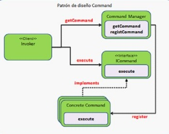
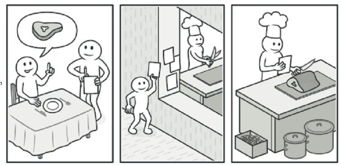
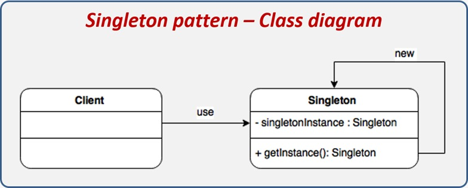
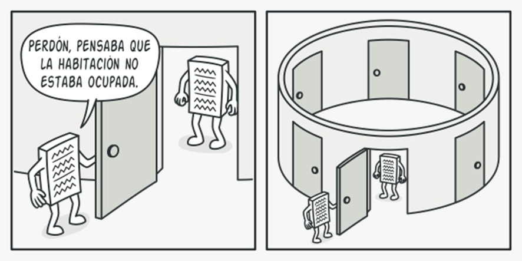
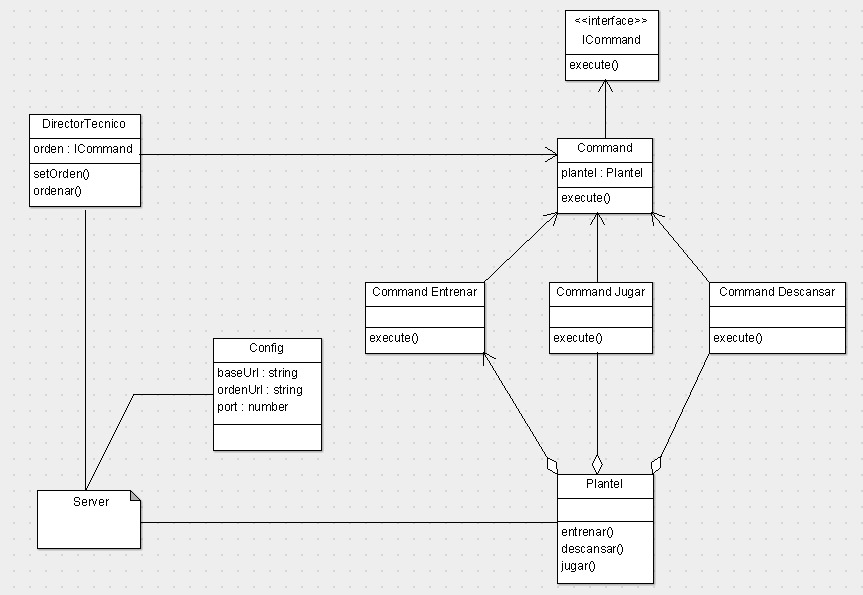

###
# PARCIAL DE PROGRAMACIÓN

_CODIGO DE PROGRAMACION COMAND_

¿Qué es el patron de diseño command?

El patrón de diseño  **Command**  es muy utilizado cuando se requiere hacer ejecuciones de operaciones sin conocer realmente lo que hacen, estas operaciones son conocidas como comandos y son implementadas como una clase independiente que realiza una acción muy concreta, para lo cual, únicamente recibe un conjunto de parámetros para realizar su tarea.

La siguiente imagen muestra la estructura del patrón de diseño:

Propósitos que cumple el patrón de diseño Command

- Encapsula un mensaje como un objeto, con lo que permite gestionar colas o registro de mensaje y deshacer operaciones.
- Soportar restaurar el estado a partir de un momento dado.
- Ofrecer una interfaz común que permita invocar las acciones de forma uniforme y extender el sistema con nuevas acciones de forma más sencilla.

Ejemplo del patrón de diseño Command en la vida real.

Tras un largo paseo por la ciudad, entras en un buen restaurante y te sientas a una mesa junto a la ventana. Un amable camarero se acerca y toma tu pedido rápidamente, apuntándolo en un papel. El camarero se va a la cocina y pega el pedido a la pared. Al cabo de un rato, el pedido llega al chef, que lo lee y prepara la comida. El cocinero coloca la comida en una bandeja junto al pedido. El camarero descubre la bandeja, comprueba el pedido para asegurarse de que todo está como lo querías, y lo lleva todo a tu mesa.

El pedido en papel hace la función de un comando. Permanece en una cola hasta que el chef está listo para servirlo. Este pedido contiene toda la información relevante necesaria para preparar la comida. Permite al chef empezar a cocinar de inmediato, en lugar de tener que correr de un lado a otro aclarando los detalles del pedido directamente contigo.

_PATRON DE DISEÑO SINLGETON_

¿Qué es el patrón de diseño de Singleton?

En ingeniería de software, singleton o instancia única es un patrón de diseño que permite restringir la creación de objetos pertenecientes a una clase o el valor de un tipo a un único objeto Su intención consiste en garantizar que una clase solo tenga una instancia y proporcionar un punto de acceso global a ella.

Propósitos de utilizar el patrón de diseño Singleton.

- Añade un campo estático privado a la clase para almacenar la instancia Singleton.
- Declara un método de creación estático público para obtener la instancia Singleton.
- Implementa una inicialización diferida dentro del método estático. Debe crear un nuevo objeto en su primera llamada y colocarlo dentro del campo estático. El método deberá devolver siempre esa instancia en todas las llamadas siguientes.
- Declara el constructor de clase como privado. El método estático de la clase seguirá siendo capaz de invocar al constructor, pero no a los otros objetos.
- Repasa el código cliente y sustituye todas las llamadas directas al constructor de la instancia Singleton por llamadas a su método de creación estático.

Ejemplo del patrón de diseño Singleton en la vida real.

Lo que podemos entender en la imagen de arriba es que, sin importar desde donde se llame al objeto, siempre obtendremos una unica instancia de este, es un objeto de tipo global, es decir que es el mismo objeto en todo el codigo.

_DIAGRAMA DE CLASES_

Explicación del código realizado

Primero creamos un objeto al cual llamamos config, tiene 3 atributos (baseurl, ordenurl y port). Este objeto es del tipo de patron singleton, por lo que solo puede haber una unica instancia de este objeto en todo el código. Sirve justamente para que no debamos estar instanciandolo, es un objeto global.

Luego se creo una clase abstracta llamada Command que implementa una interfaz (ICommand), esta interfaz tiene un método execute, por lo tanto todas las clases que implementen esta interfaz deben tener este mismo método. Regresando con la clase abstracta, la misma también define un constructor y un método abstracto (execute). Todas las clases que hereden de command tendrán que implementar este metodo dando a la posibilidad de utilizar polimorfismo.

A continuación se creó la clase Plantel que tiene 3 metodos, entrenar, descansar y jugar, cada uno de estos métodos nos devuelve una acción diferente que realiza el plantel. Y se crearon las 3 clases JugarCommand, DescansarCommand y EntrenarCommand. Estas 3 clases son una extensión de la clase abstracta command.
Se creo la clase DirectorTecnico cuenta con un atributo que es orden, un método que es setOrden, que recibe una orden y la setea como atributo y por último otro método que se llama ordenar que lo que hace es ejecutar dicha orden (comando).